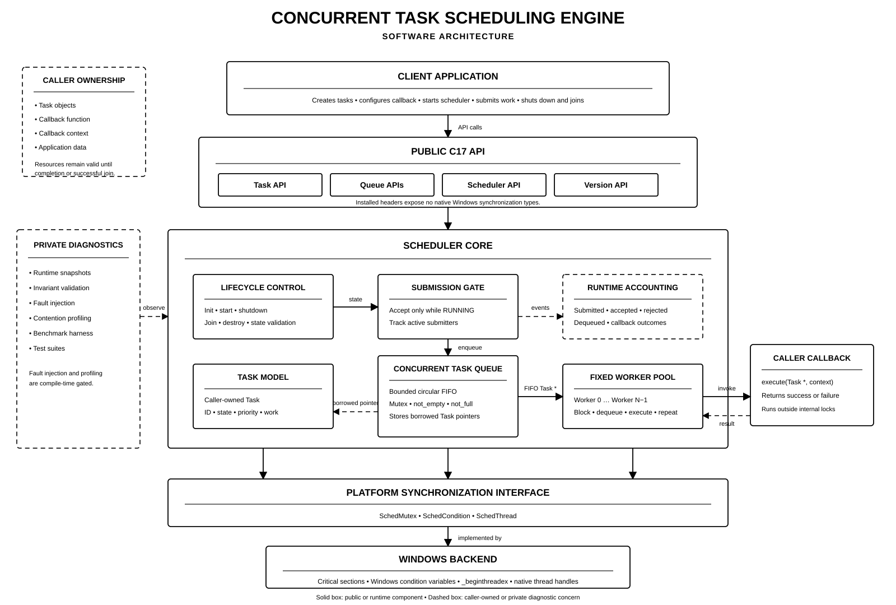
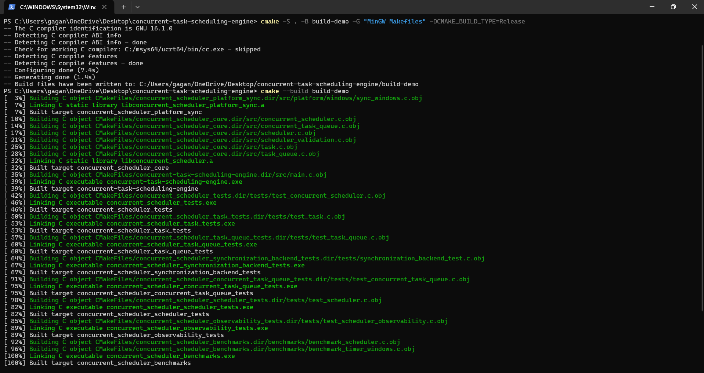
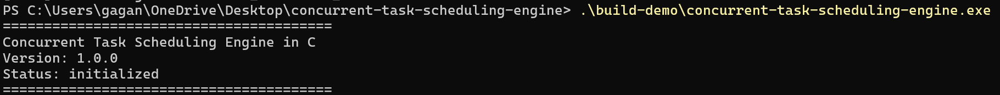
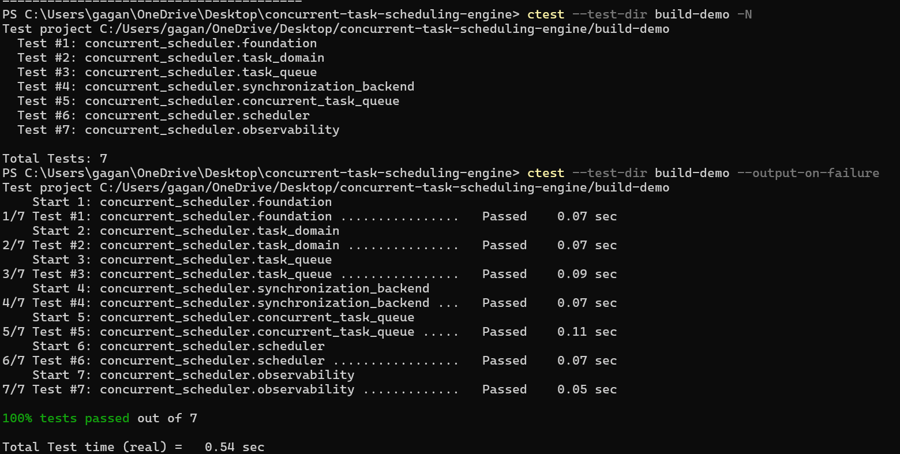
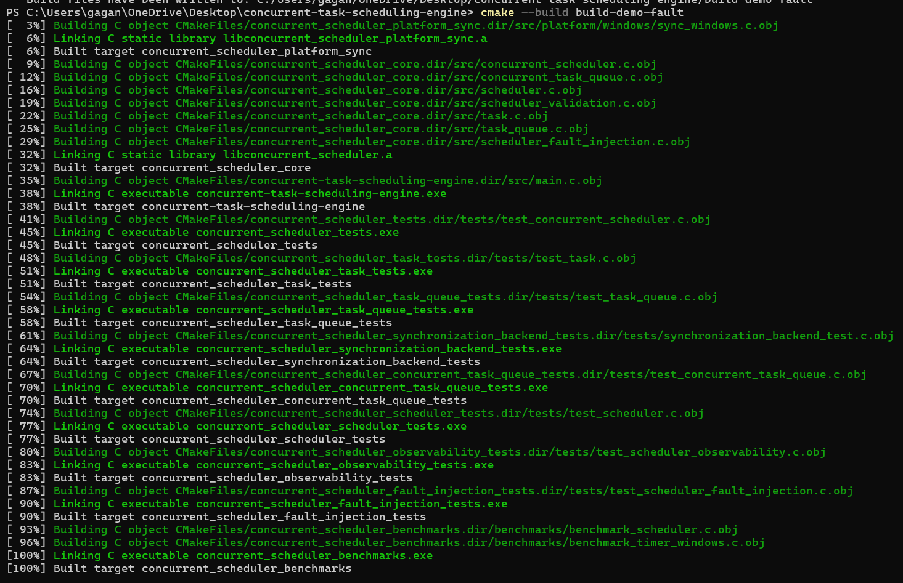
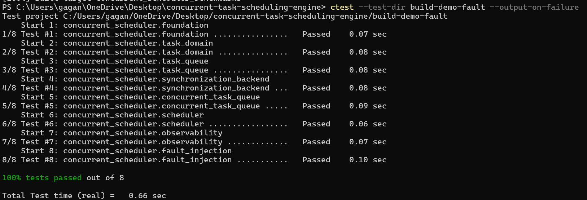
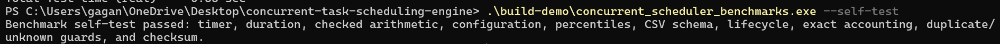
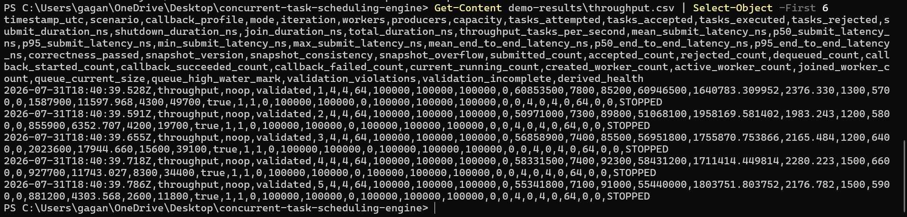
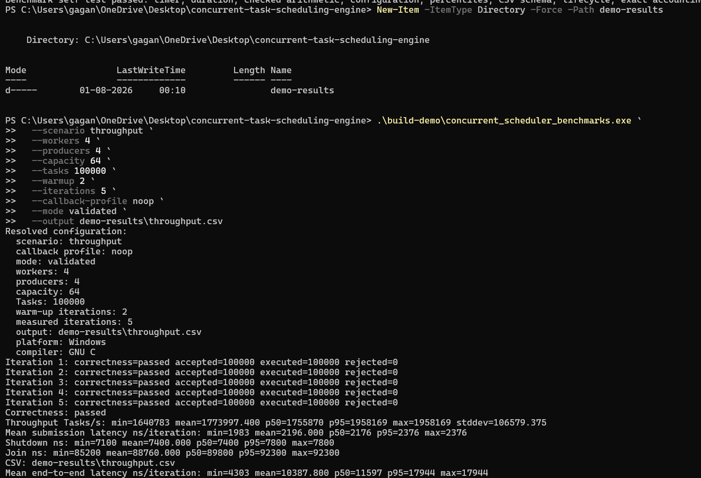

# Concurrent Task Scheduling Engine

A C17 library for executing caller-owned tasks on a fixed-size worker pool. It
provides a bounded FIFO queue, blocking and non-blocking submission, explicit
lifecycle control, graceful shutdown, and deterministic runtime accounting. The public API is independent of native threading types. The current
synchronization backend targets Windows and uses critical sections, condition
variables, and `_beginthreadex`.

## Project Metrics

| Metric | Value |
|---|---|
| Language standard | C17 |
| Normal test suites | 7 |
| Fault-injection suite | 1 additional build-gated suite |
| Scheduling model | Fixed worker pool with bounded FIFO dispatch |
| Submission APIs | Blocking and non-blocking |
| Benchmark output | Per-iteration CSV with correctness status |
| Supported backend | Windows |
| Build system | CMake 3.20+ |
| Package target | `ConcurrentScheduler::concurrent_scheduler` |

## Technology Stack

| Area | Technology |
|---|---|
| Core implementation | ISO C17 |
| Build and packaging | CMake, CTest, GNUInstallDirs, package config exports |
| Synchronization abstraction | Private `SchedMutex`, `SchedCondition`, and `SchedThread` interface |
| Windows backend | Critical sections, condition variables, `_beginthreadex` |
| Runtime accounting | C17 atomics, mutex-protected counters, saturating arithmetic |
| Benchmark timing | Windows high-resolution performance counter |
| Benchmark analysis | Dependency-free Python CSV analysis |
| Report automation | PowerShell and Python scripts |

## Project Highlights

- **Concurrent runtime:** A fixed worker pool consumes caller-owned task
  pointers from a mutex-protected bounded circular FIFO.
- **Backpressure:** Blocking submission waits for capacity, while non-blocking
  submission reports a full queue immediately.
- **Explicit lifecycle:** Initialization, worker startup, graceful shutdown,
  joining, and destruction have separate contracts and failure behavior.
- **Graceful draining:** Shutdown closes admission, wakes blocked operations,
  and preserves accepted tasks for worker completion.
- **Ownership discipline:** The scheduler owns queue and worker resources but
  never assumes ownership of tasks or callback context.
- **Runtime reliability:** Private snapshots, saturating counters, invariant
  validation, and derived health describe live and quiescent state.
- **Failure-path verification:** Compile-time fault injection deterministically
  exercises allocation, worker-creation, and join-result failures.
- **Performance engineering:** The benchmark harness combines controlled
  workloads, high-resolution timing, correctness gates, CSV evidence, and
  contention profiling.
- **Package integration:** Installed headers, version compatibility metadata,
  and a namespaced CMake target support reuse by other projects.
- **Platform isolation:** Public headers contain no native Windows threading
  types; synchronization remains behind a private backend boundary.

Task priorities are metadata; scheduling remains FIFO. Scheduler-level
cancellation is not part of the public API.

## Repository Structure

### Folder Preview

```text
concurrent-task-scheduling-engine/
├── CMakeLists.txt                 Build configuration
├── LICENSE                        MIT License
├── README.md                      Project documentation
│
├── include/
│   └── concurrent_scheduler/      Public C17 API
│
├── src/
│   ├── internal/                  Private diagnostics and utilities
│   ├── platform/
│   │   └── windows/               Windows synchronization backend
│   └──                            Scheduler, queue, task, and worker implementation
│
├── tests/                         Unit and concurrency test suites
├── benchmarks/                    Benchmark harness and timing utilities
├── results/                       Benchmark, profiling, and optimization results
├── docs/
│   ├── diagrams/                  Software architecture diagrams
│   ├── images/                    Performance and profiling charts
│   └── releases/                  Release documentation
│
├── scripts/                       Build automation and report generation
├── tools/                         Benchmark analysis utilities
└── cmake/                         CMake package configuration
```

Build directories are generated locally and are not part of the source
architecture.

| Path | Purpose |
|---|---|
| `include/concurrent_scheduler/` | Installed public API |
| `src/` | Core task, queue, scheduler, and validation implementation |
| `src/internal/` | Private observability, profiling, and fault-injection interfaces |
| `src/platform/windows/` | Windows synchronization backend |
| `tests/` | Deterministic test executables |
| `benchmarks/` | Benchmark harness and Windows timer |
| `results/` | Recorded baseline, profiling, optimization, and stability evidence |
| `scripts/` | Reproduction and report-asset generation scripts |
| `tools/` | Standalone benchmark analysis utility |
| `docs/` | Architecture, reliability, performance, and release documentation |
| `cmake/` | Installed-package configuration template |

## Demo

The following run uses Windows, C17, CMake, and the MinGW Makefiles generator.

### Software Architecture



### Successful build



### Application Execution



### Test Suite



### Deterministic Fault Injection





### Benchmark self-test



### Benchmark CSV




### Validated Benchmark



### Throughput vs Workers


## Build

### Requirements

- Windows or a compatible Windows environment
- CMake 3.20 or newer
- A C17 compiler
- MinGW Makefiles and GCC, or another supported Windows CMake toolchain

Linux and macOS are not supported because no synchronization backend is
available for those platforms.

### Release build with MinGW

```powershell
cmake -S . -B build -G "MinGW Makefiles" -DCMAKE_BUILD_TYPE=Release
cmake --build build
.\build\concurrent-task-scheduling-engine.exe
```

### Debug build with MinGW

```powershell
cmake -S . -B build-debug -G "MinGW Makefiles" -DCMAKE_BUILD_TYPE=Debug
cmake --build build-debug
.\build-debug\concurrent-task-scheduling-engine.exe
```

### Install the library

```powershell
cmake --install build --prefix build-install
```

Include the public API through the umbrella header:

```c
#include <concurrent_scheduler/concurrent_scheduler.h>
```

The install includes the static library, public headers, MIT license, and CMake
package metadata. A CMake consumer can use:

```cmake
find_package(ConcurrentScheduler 1.0 REQUIRED)
target_link_libraries(
    my_program
    PRIVATE
        ConcurrentScheduler::concurrent_scheduler
)
```

## Running Tests

Configure and build, then run the complete normal test suite:

```powershell
ctest --test-dir build -N
ctest --test-dir build --output-on-failure
```

The normal Windows build registers seven CTests covering:

- Version and library initialization
- Task lifecycle and work accounting
- Non-thread-safe FIFO queue behavior
- Windows synchronization primitives
- Concurrent queue behavior and shutdown
- Scheduler lifecycle, submission, execution, and cleanup
- Runtime observability and invariant validation

Fault injection is compile-time gated and disabled by default. Run its
additional test executable from a separate Debug build:

```powershell
cmake -S . -B build-fault -G "MinGW Makefiles" `
  -DCMAKE_BUILD_TYPE=Debug `
  -DCONCURRENT_SCHEDULER_ENABLE_FAULT_INJECTION=ON
cmake --build build-fault
ctest --test-dir build-fault --output-on-failure
```

## Running Benchmarks

Use a dedicated Release build:

```powershell
cmake -S . -B build-bench -G "MinGW Makefiles" -DCMAKE_BUILD_TYPE=Release
cmake --build build-bench
.\build-bench\concurrent_scheduler_benchmarks.exe --self-test
```

Example validated throughput run:

```powershell
.\build-bench\concurrent_scheduler_benchmarks.exe `
  --scenario throughput `
  --workers 4 `
  --producers 4 `
  --capacity 64 `
  --tasks 100000 `
  --warmup 3 `
  --iterations 10 `
  --callback-profile noop `
  --mode validated `
  --output build-bench\benchmark-results.csv
```

The harness supports deterministic no-op, light CPU, medium CPU, and controlled
blocking callbacks. Its CSV output records configuration, submission and
end-to-end latency, shutdown and join duration, throughput, and correctness
status. See [Benchmark Methodology](benchmarks/README.md) for the complete CLI,
measurement boundaries, schema, and interpretation constraints.

## Performance Analysis

Recorded measurements and environment descriptions are retained under
`results/`:

- `results/baseline/` contains the baseline matrix and raw runs.
- `results/profiling/` separates scheduler contention from benchmark-accounting
  contention.
- `results/optimization/` contains control and candidate measurements.

Generate statistical summaries from benchmark CSV files with:

```powershell
python tools\analyze_benchmark.py build-bench\benchmark-results.csv
```

Use `scripts/reproduce_performance_evaluation.ps1` to reproduce the documented
evaluation matrix. The scripts under `scripts/` automate experiments and
report assets; `tools/analyze_benchmark.py` analyzes an existing CSV without
running the scheduler.

See [Performance Evaluation Summary](docs/performance-evaluation-summary.md)
for measured conclusions and their scope.

## Documentation

- [Architecture](docs/architecture.md) — component boundaries, ownership, worker
  lifecycle, and observability design
- [Threading Architecture](docs/threading-architecture.md) — synchronization,
  concurrent operations, and shutdown behavior
- [Benchmark Plan](docs/benchmark-plan.md) — controlled variables and
  measurement protocol
- [Performance Evaluation Summary](docs/performance-evaluation-summary.md) —
  baseline, contention, optimization, scalability, and stability evidence
- [Reliability Report](docs/reliability-report.md) — runtime snapshots,
  invariants, deterministic faults, and recovery
- [Robustness and Static Analysis](docs/robustness-and-static-analysis.md) —
  compiler, static-analysis, and undefined-behavior audit

Public API contracts are documented directly in the installed headers under
`include/concurrent_scheduler/`.

## Design Principles

- Caller ownership is explicit and never transferred implicitly.
- Lifecycle transitions and failure guarantees are deterministic.
- Public interfaces avoid exposing native synchronization types.
- Platform-specific code remains behind a private synchronization boundary.
- Profiling and fault injection are private, optional, and disabled by default.
- Benchmarks gate reported measurements on correctness checks.

## Future Work

The existing platform interface can accommodate another synchronization
backend without exposing native types through the public API. The queue and
worker boundaries also provide controlled seams for evaluating alternative
bounded queues, batching, per-worker queues, work stealing, or affinity
policies. Task priority is currently metadata, so a future scheduling-policy
implementation could consume it while preserving the present ownership and
lifecycle contracts.

Any extension should retain graceful draining, deterministic cleanup,
correctness-gated benchmarks, and the explicit rollback criteria used by the
current performance evaluation.

## License

This project is licensed under the [MIT License](LICENSE).
