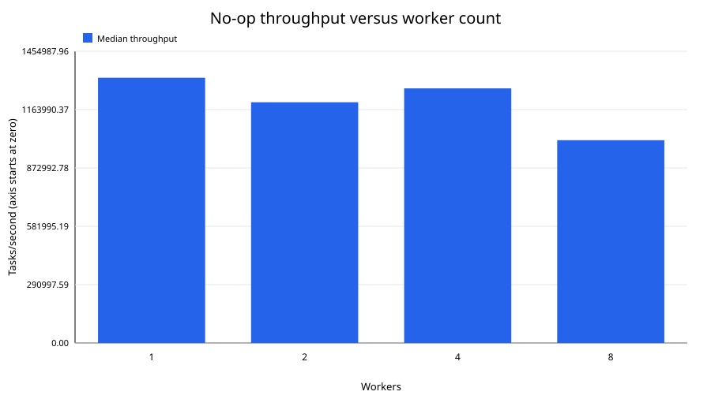
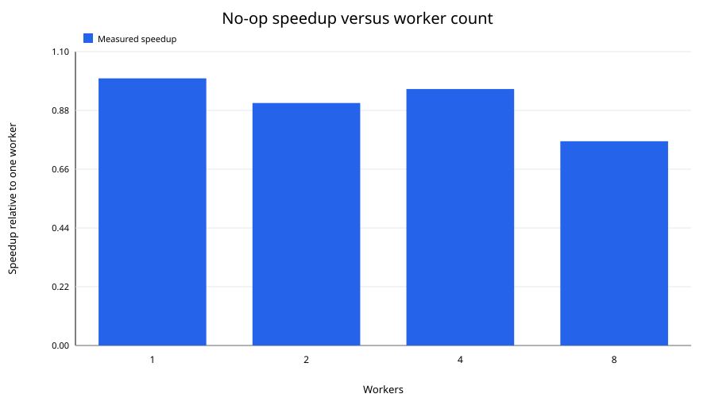
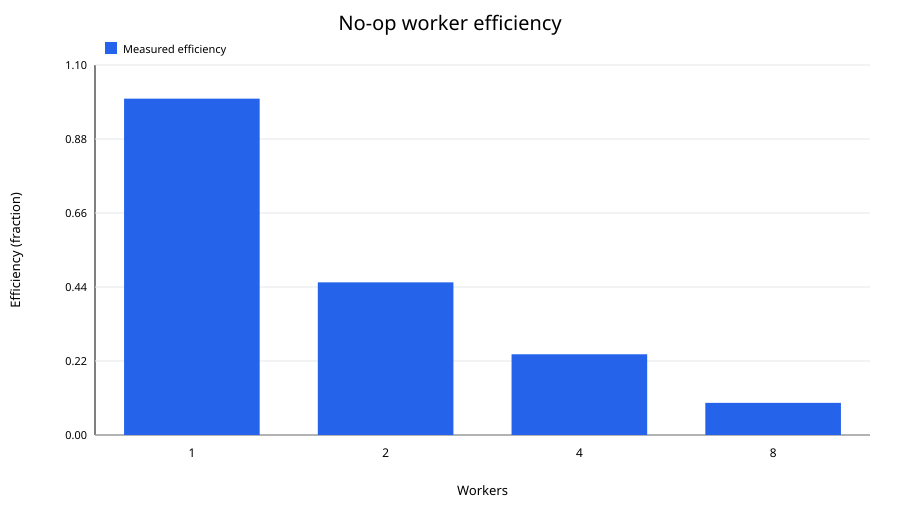
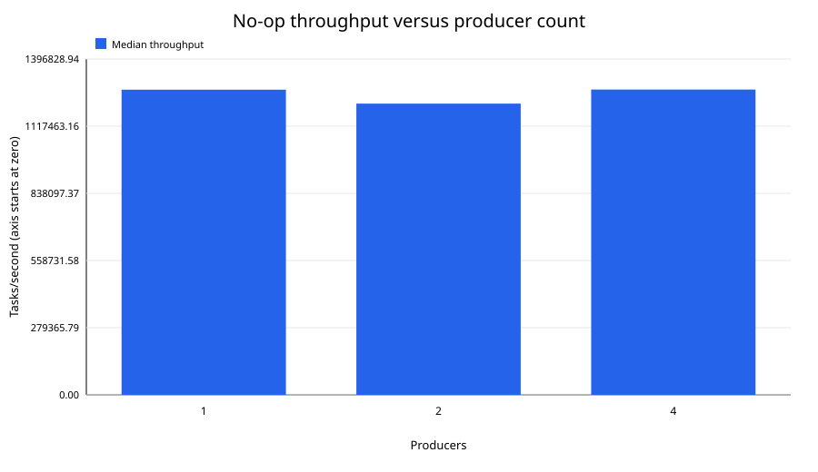
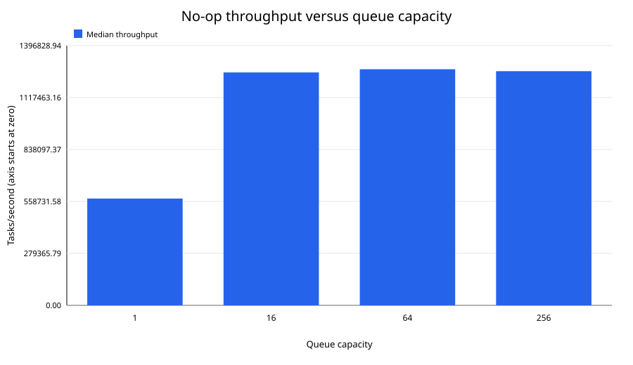
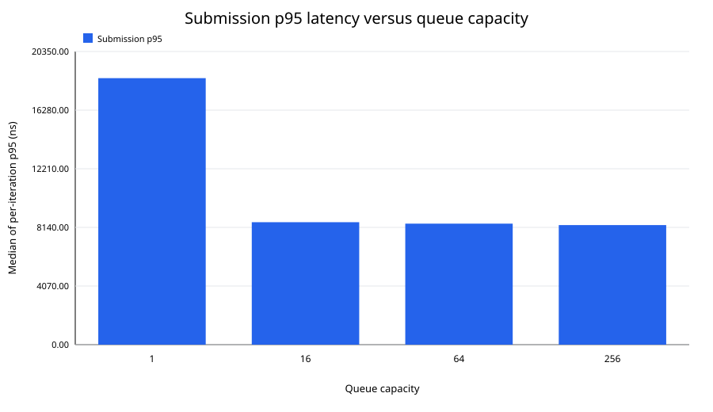
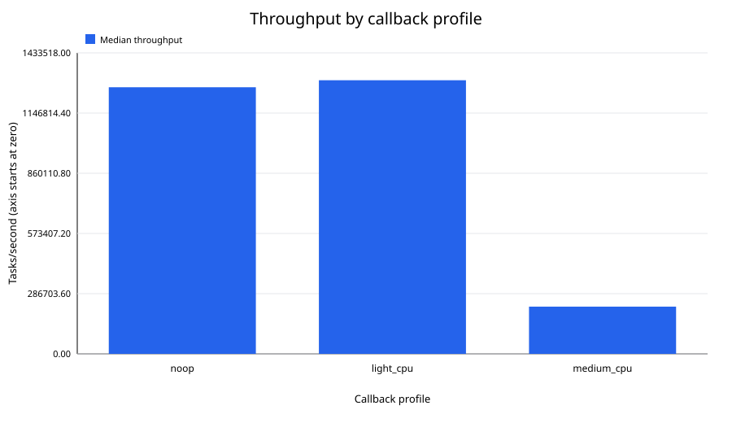
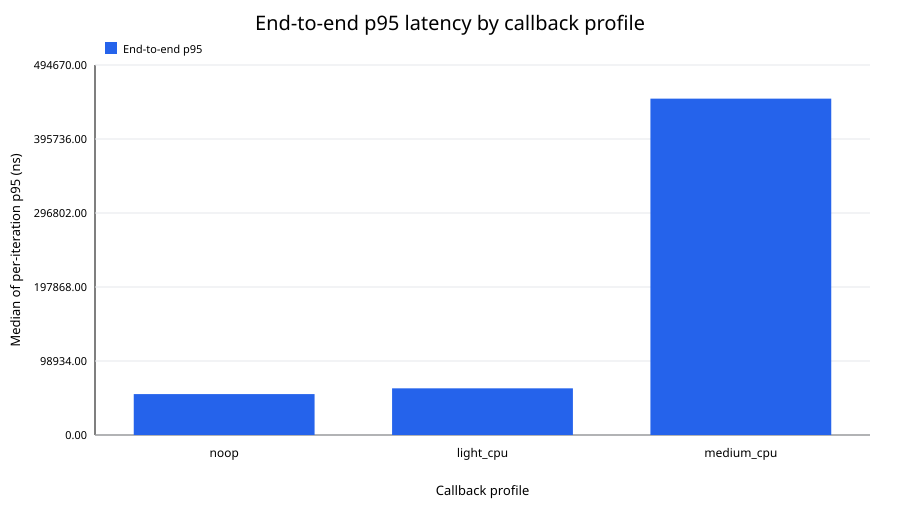
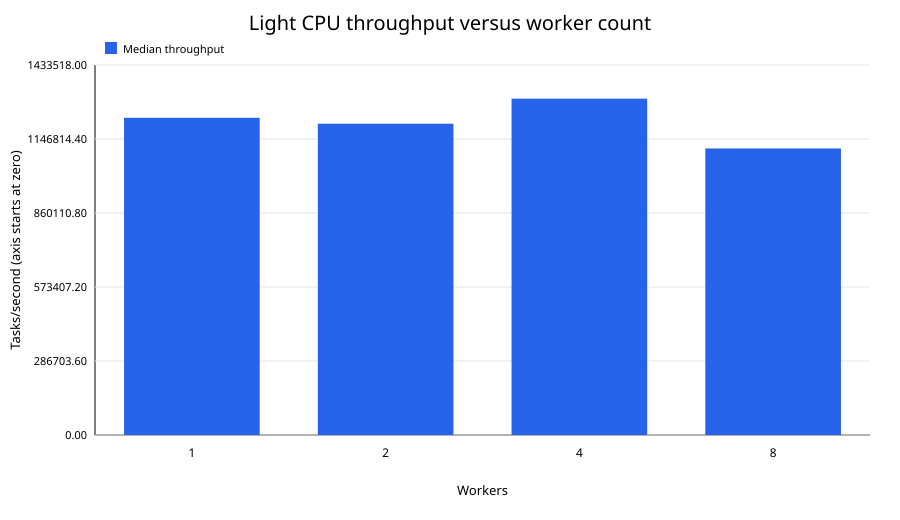
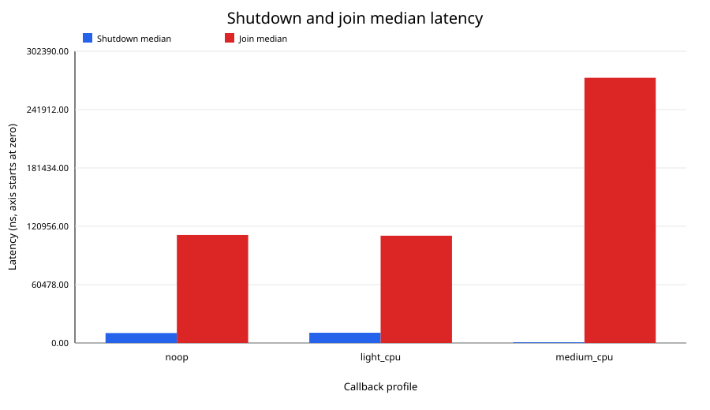

# Phase 5 baseline benchmark report

## 1. Executive summary

This baseline executed 17 benchmark commands and retained 170 measured
iterations. All 16,010,000 accepted Tasks executed exactly once; there were no
rejections or correctness failures.

The strongest direct result is negative scaling for the no-op workload:
median throughput was 1,322,716 Tasks/s with one worker and 1,269,844 Tasks/s
with four. Capacity one reduced median throughput by 54.77% relative to
capacity 64. Medium CPU work reduced median throughput to 224,902 Tasks/s and
raised the median of per-iteration end-to-end p95 values to 449,700 ns.

Both required repetition comparisons were environmentally unstable. The
four-worker no-op repeat differed by 38.94% and the light CPU repeat by 41.92%.
Consequently, small differences—such as light CPU exceeding no-op by 2.63% in
the primary callback comparison—are observations, not durable performance
conclusions.

## 2. Scope

The report measures worker, producer, queue-capacity, and deterministic
callback-cost configurations using the validated Phase 5.1 harness. It also
records shutdown, join, submission, and end-to-end latency.

## 3. Non-goals

This checkpoint does not optimize code, identify a confirmed root cause,
measure worker utilization, compare other machines, or establish universal
scalability.

## 4. Baseline commit

All measurements use commit
`5b2a3cc2253aaab81a9b5223a8a45e5026b4581c` on `main`. The Phase 4 stable tag
remained on `35eef43`. The optional Phase 5.1 tag was not present.

## 5. Machine environment

The run used Windows NT 10.0.26200.0 on AMD64 with an 11th Gen Intel Core
i5-1155G7 and eight reported logical processors. GCC 16.1.0 and CMake 4.4.0
produced the Release executable. The active plan was Balanced. Full details,
including unavailable fields and environmental limitations, are in
[environment.md](../results/baseline/environment.md).

## 6. Build configuration

The benchmark was built with MinGW Makefiles and
`CMAKE_BUILD_TYPE=Release`; the cache recorded `-O3 -DNDEBUG`. The build
completed without compiler warnings.

## 7. Methodology

Primary configurations used 100,000 Tasks, validated accounting, three
warm-ups, and ten measured fresh scheduler lifecycles. No outlier was removed.
Cross-iteration p50 and p95 use the Phase 5.1 nearest-rank definition.

Summary latency columns explicitly contain medians of per-iteration
percentiles. They are not presented as percentiles of one pooled Task-latency
distribution. Raw rows remain unchanged under
`results/baseline/raw/`.

## 8. Correctness gate

Every CSV passed header, field-count, row-count, configuration, iteration,
numeric, lifecycle, accounting, and correctness validation. Accepted equaled
executed, rejected was zero, and every row reported `correctness_passed=true`.
The validated harness would fail an iteration on a duplicate or unknown Task
pointer, so all successful rows imply zero such callbacks.

## 9. Benchmark matrices

| Matrix | Varied values | Fixed values |
|---|---|---|
| No-op workers | 1, 2, 4, 8 workers | 4 producers, capacity 64 |
| Producers | 1, 2, 4 producers | 4 workers, capacity 64, no-op |
| Capacity | 1, 16, 64, 256 | 4 workers, 4 producers, no-op |
| Callback | no-op, light, medium | 4 workers, 4 producers, capacity 64 |
| Light workers | 1, 2, 4, 8 workers | 4 producers, capacity 64 |

All primary matrix rows used 100,000 Tasks and ten measured iterations.

## 10. Worker scaling results

| Workers | Median Tasks/s | Mean Tasks/s | P95 Tasks/s | Stddev | Speedup | Efficiency |
|---:|---:|---:|---:|---:|---:|---:|
| 1 | 1,322,716 | 1,369,240 | 1,608,594 | 170,787 | 1.000 | 100.00% |
| 2 | 1,200,634 | 1,210,756 | 1,391,829 | 82,729 | 0.908 | 45.39% |
| 4 | 1,269,844 | 1,287,034 | 1,504,463 | 100,221 | 0.960 | 24.00% |
| 8 | 1,011,326 | 1,019,904 | 1,155,231 | 61,376 | 0.765 | 9.56% |

Observation: one worker achieved the highest primary median no-op throughput.
One-to-two speedup was 0.908 and one-to-four speedup was 0.960. Eight workers
were 20.36% slower than four by median throughput.

Inference: this very small callback does not benefit from additional workers
on this run; coordination and contention costs are not amortized.





## 11. Producer scaling results

| Producers | Median Tasks/s | Mean Tasks/s | Median iteration p95 submit ns | Stddev |
|---:|---:|---:|---:|---:|
| 1 | 1,269,155 | 1,280,701 | 1,300 | 108,049 |
| 2 | 1,211,276 | 1,193,741 | 4,200 | 50,372 |
| 4 | 1,269,844 | 1,287,034 | 8,400 | 100,221 |

Observation: aggregate median throughput with four producers was only 0.05%
above one producer, while submission p95 increased from 1,300 ns to 8,400 ns.
Two producers produced the lowest median throughput of these three runs.

Inference: additional producers did not materially improve aggregate throughput
and increased submission contention. One producer had the lowest measured
submission latency.



## 12. Queue-capacity results

| Capacity | Median Tasks/s | Mean Tasks/s | Median iteration p95 submit ns | Median iteration p95 end-to-end ns |
|---:|---:|---:|---:|---:|
| 1 | 574,335 | 609,214 | 18,500 | 19,100 |
| 16 | 1,252,624 | 1,269,793 | 8,500 | 17,000 |
| 64 | 1,269,844 | 1,287,034 | 8,400 | 54,700 |
| 256 | 1,259,493 | 1,295,052 | 8,300 | 191,500 |

Observation: capacity one was 54.77% below capacity 64. Capacity 256 was 0.82%
below capacity 64 by median throughput, while its end-to-end p95 summary was
3.50 times larger.

Inference: capacity one demonstrates strong backpressure. Increasing capacity
from 64 to 256 did not materially improve throughput and permitted more queue
waiting in these measurements.




## 13. Callback-profile results

| Profile | Median Tasks/s | Mean Tasks/s | P95 Tasks/s | Stddev | Median iteration p95 end-to-end ns |
|---|---:|---:|---:|---:|---:|
| no-op | 1,269,844 | 1,287,034 | 1,504,463 | 100,221 | 54,700 |
| light CPU | 1,303,198 | 1,331,567 | 1,586,458 | 125,161 | 62,400 |
| medium CPU | 224,902 | 223,446 | 247,582 | 15,113 | 449,700 |

Observation: light CPU had the highest primary median throughput, 2.63% above
no-op, but that difference is much smaller than the stability drift. Medium CPU
had the highest end-to-end latency and 82.29% lower throughput than no-op.




## 14. Light CPU scaling results

| Workers | Median Tasks/s | Mean Tasks/s | Stddev | Speedup | Efficiency |
|---:|---:|---:|---:|---:|---:|
| 1 | 1,228,930 | 1,193,725 | 127,352 | 1.000 | 100.00% |
| 2 | 1,206,137 | 1,264,155 | 193,746 | 0.981 | 49.07% |
| 4 | 1,303,198 | 1,331,567 | 125,161 | 1.060 | 26.51% |
| 8 | 1,110,159 | 1,139,947 | 104,750 | 0.903 | 11.29% |

Observation: light CPU achieved 1.060x speedup at four workers, compared with
0.960x for no-op. Eight workers were slower than four for both profiles.

Inference: added callback work improved the observed four-worker scaling
slightly, but not enough to overcome the demonstrated environmental variation.



## 15. Controlled backpressure result

The one-worker, one-producer, capacity-one controlled-blocking scenario passed
all ten iterations for 1,000 Tasks each. Median throughput was 1,206,273
Tasks/s. This is behavioral evidence that deterministic condition-based release
and bounded-queue backpressure complete correctly; its throughput is not
compared with the normal callback profiles.

## 16. Repetition and stability analysis

| Configuration | Primary median Tasks/s | Repeat median Tasks/s | Relative difference |
|---|---:|---:|---:|
| no-op, 4W/4P/C64 | 1,269,844 | 775,353 | 38.94% |
| light CPU, 4W/4P/C64 | 1,303,198 | 756,838 | 41.92% |

Both differences exceed 10%, so both repeated configurations are flagged
environmentally unstable. Task accounting and ten-row structure were identical
and correct. Background scheduling, frequency scaling, thermal state, OneDrive,
and antivirus activity are plausible environmental causes, but none was
isolated.

## 17. Shutdown and join analysis

| Profile | Median shutdown ns | Median join ns | Median total ns | Shutdown/total | Join/total |
|---|---:|---:|---:|---:|---:|
| no-op | 10,300 | 112,000 | 77,899,400 | 0.0132% | 0.1438% |
| light CPU | 10,600 | 111,200 | 76,141,700 | 0.0139% | 0.1460% |
| medium CPU | 700 | 274,900 | 438,824,600 | 0.0002% | 0.0626% |

Shutdown was a very small fraction of total duration. Join exceeded shutdown
because it includes remaining drain and worker termination, but remained below
0.15% of median total duration in these profile runs.



## 18. Key observations

- The highest no-op median was the one-worker configuration at 1,322,716
  Tasks/s.
- Multiple producers raised submission latency without a material aggregate
  throughput gain.
- Capacity one sharply reduced throughput.
- Capacity 256 did not outperform 64 and had substantially higher end-to-end
  p95 latency.
- Medium CPU work dominated the callback-profile comparison.
- Eight workers did not outperform four for either worker-scaling profile.
- Every correctness gate passed.

## 19. Supported inferences

The no-op workload appears scheduler/coordination-bound because additional
workers did not improve throughput. Medium CPU appears callback-bound because
fixed callback work caused a large throughput reduction and end-to-end latency
increase. Capacity-one behavior is consistent with intentional producer
backpressure.

These inferences are machine- and run-specific and are weakened by the large
repeat variation.

## 20. Profiling hypotheses

- Hypothesis: shared queue locking or condition signaling limits no-op scaling.
- Hypothesis: callback-accounting mutex contention contributes to the flat
  light CPU worker curve.
- Hypothesis: Windows scheduling and frequency/thermal changes explain a
  substantial portion of the repeat drift.
- Hypothesis: capacity 256 increases residence time because producers can get
  farther ahead of workers.

None is a confirmed root cause.

## 21. Threats to validity

The Balanced power plan, background CPU load, Windows scheduling, CPU frequency
scaling, thermal throttling, antivirus, OneDrive, first-run page faults,
allocator state, console activity, validated-accounting overhead, and ten-run
sample size may affect measurements. The repeat results directly demonstrate
environmental instability.

## 22. Limitations

Physical core count, total memory, battery state, CPU time, memory use, and
worker utilization were unavailable or not measured. Per-iteration
percentiles were summarized across iterations rather than pooled. Only one
machine and compiler configuration was measured.

## 23. Baseline conclusions

The baseline is correctness-valid and fully traceable, but not stable enough
for fine-grained optimization claims. Large effects—capacity-one backpressure,
medium callback cost, and failure of eight-worker scaling—are visible. Small
differences require a more controlled rerun.

## 24. Recommendations for Checkpoint 5.3

Profile the no-op 1/4/8-worker configurations, capacity 1 versus 64, and medium
CPU at four workers. Measure queue-lock wait, condition wake-ups, callback
accounting cost, and OS scheduling behavior if defensible tooling is available.
Repeat profiling captures under more stable environmental conditions before
forming an optimization hypothesis.

## 25. Reproduction commands

```powershell
cmake -S . -B build-bench -G "MinGW Makefiles" -DCMAKE_BUILD_TYPE=Release
cmake --build build-bench
.\build-bench\concurrent_scheduler_benchmarks.exe --self-test
.\build-bench\concurrent_scheduler_benchmarks.exe `
  --scenario throughput --workers 4 --producers 4 --capacity 64 `
  --tasks 100000 --warmup 3 --iterations 10 `
  --callback-profile noop --mode validated `
  --output results/baseline/raw/workers_noop_w4_p4_c64_t100000.csv
python scripts/generate_baseline_report_assets.py
```

Change only the intended matrix dimension and use the deterministic filenames
listed below.

## 26. Raw-data inventory

- `workers_noop_w{1,2,4,8}_p4_c64_t100000.csv`
- `producers_noop_w4_p{1,2}_c64_t100000.csv`
- `capacity_noop_w4_p4_c{1,16,256}_t100000.csv`
- `profiles_{light_cpu,medium_cpu}_w4_p4_c64_t100000.csv`
- `workers_light_cpu_w{1,2,8}_p4_c64_t100000.csv`
- `repeat_{noop,light_cpu}_w4_p4_c64_t100000.csv`
- `controlled_blocking_w1_p1_c1_t1000.csv`

The shared primary 4W/4P/C64 no-op and light CPU files supply the omitted
matrix intersections. Full-precision summaries are in
[baseline-summary.csv](../results/baseline/baseline-summary.csv).
